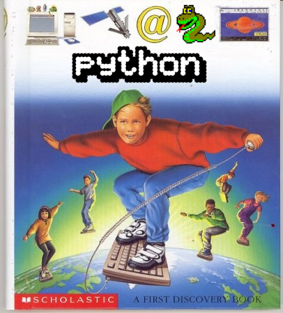
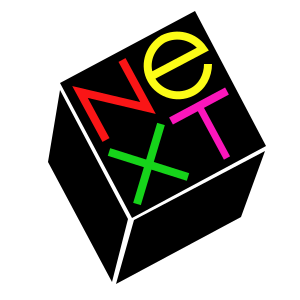
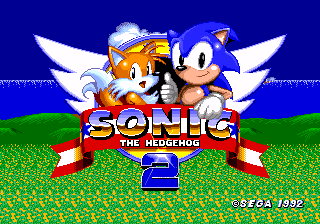

# Writing machine learning code on 20 year old software on 30 year old hardware

In this series, I'm going to document my experiences with attempting to write and execute a machine learning program in Python 1.6 on a NeXT hardware emulator running NeXTSTEP. 

**Two points up front**: 

1. This is a pointless, silly thing to do.
2. I hope you end up enjoying the ride as much as I do.

There's a good chance that the challenge outlined may be mostly nonsensical to you, and it's not clear why it's a silly thing to do. 

Let me paint the broad strokes.

## The goal

The challenge I've outlined has three components:
 
1. *Write* and *execute* a machine learning program;
2. In *Python 1.6*;
3. Compiled from source in *NeXTSTEP*.

### Machine learning

To be clear, the easiest part of this challenge be the *machine learning* component. I'm very much of the school of thought that the term 'machine learning' covers a broad church which includes the foundational but insanely useful algorithms like linear and logistic regression. These are relatively simple algorithms to implement in any programming environment. 

Call this part of the challenge an excuse to frame this whole exercise as "an exploration in the worst possible way in writing ML". 

### Python 1.6

*Python 1.6* - What's interesting about that? Well, Python is a wonderful, fully-featured and robust language - and it's certainly *my* go-to language, especially in the realm of data analysis and machine learning. Personally, I began using Python in its venerable Python 2.7 version, before making the jump to various 3.x versions full-time over the last five years.

But Python is a surprisingly old language, with its first release being in 1991, or fully 30 years ago! 

 

*Warning: may not be an official Python document.*

The language has made incredible leaps and bounds in power and functionality even the limited time I've been using it. I'm curious to rewind the clock 21 years to its 1.6 release and explore the idiosyncracies of these early releases.

### NeXT and NeXTSTEP

Finally, perhaps the most challenging to explain: NeXT and NeXTSTEP. [NeXT](https://en.wikipedia.org/wiki/NeXT) was a hardware and software company that existed in the mid 1980s-90s; their core software product was an operating system (OS) called NeXTSTEP. There is *a lot* to unpack around NeXT, but there are three main reasons why I'm intrigued:

* NeXT was the baby of Steve Jobs, and is most often associated with his "second act" between being cast out of Apple and eventually rejoining; it's a period of his life often brushed over, perhaps because of just how poorly he managed NeXT. This is charitably referred to as the time when he made mistakes and learnt to be a leader. NeXT has a long and dramatic history which I cannot pretend to do justice; [it's definitely worth exploring](https://www.amazon.com/Steve-Jobs-Next-Big-Thing/dp/0689121350) if you're interested in computing lore.
* Drama aside, the NeXTSTEP OS was genuinely innovative for its time; it was an impressive technical achievement and regarded as a powerful development environment. NeXT machines and NeXTSTEP were associated with many technological touchstones of the 90s: [Doom](https://www.forbes.com/sites/quora/2016/09/01/why-john-carmack-chose-next-for-developing-doom-and-other-favorites/?sh=6c97663614d1) and the [World Wide Web](https://collection.sciencemuseumgroup.org.uk/objects/co8232360/next-cube-computer-1990-personal-computer) (pick your preferred order of importance) were both developed on NeXT products.
* Finally, there's a good chance you still use a descendent of NeXTSTEP. NeXTSTEP eventually formed the basis of Apple's Mac OS X, and consequently MacOS, iOS, iPadOS, etc. NeXTSTEP is history, but its lineage goes on.

*Also, NeXT had a really neat logo (which of course has an associated story).*

## But... why?

Why would I burn my limited free time on a silly project like this? That's a very legitimate question. There are two primary reasons.

Pragmatically, **technological broadening and skill development** is a common and welcome outcome. I always find that carrying out a silly challenge like this introduces a bunch of unexpected technical challenges, and solving them broadens my horizons greatly. With this challenge, I expected I'm going to learn a good amount around compiling programs from scratch and manipulating disk images -- and who knows what else.  

To quote [Elting E. Morison](https://mitpress.mit.edu/books/men-machines-and-modern-times-50th-anniversary-edition), we should consider "the story of the three princes of Serendip who set out to find some interesting object on a journey through their realm. They did not find the particular object of their search, but along the way they discovered many new things simply because they were looking for something." In other words - set an arbitrary goal, accomplish other things along the way.

But my main driver is not personal development - it's **curiosity**. Here is an opportunity to dive backwards in time to explore and use tools and portions of "history". I want to see what was saved and what was lost. 

Seeing systems and objects in their "prototypical" forms has long been a passion of mine; as a child, I spent a lot more time exploring the [Sonic the Hedgehog 2 prototype community](http://info.sonicretro.org/Sonic_the_Hedgehog_2_(Simon_Wai_prototype)) than I ever did playing the completed game!

*P.S., did you know they just recently found a [Sonic 1 prototype](https://tcrf.net/Proto:Sonic_the_Hedgehog_(Genesis)) after two decades of searching?*

## Future articles and next steps

(Pardon the pun.) 

Future articles are going to cover the numerous steps on the road to achieve the goals set out above.

Because this is going to knit together a lot of publically available resources, future articles will include some main sections:

* **Challenges and decisions**, covering some of the surprising bumps in the road I assume I will encounter,
* A **series review**, covering what's been done so far,
* A **summary of findings** including all of the key links and resources I've hit upon, and;
* **Things to explore further**, noting things that I was curious about but didn't dig into more.

Hopefully these will help form useful resources for any folks who want to dig around in the same sandpit as me.

See you next time!

