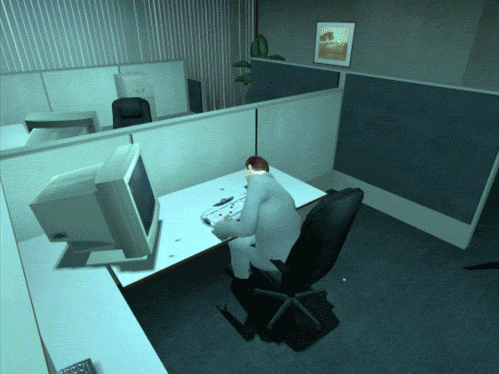

# Moving forward with Previous

In this series, I'm documenting my experiences with attempting to write and execute a machine learning program in Python 1.6 on a NeXT hardware emulator running NeXTSTEP. 

As I outlined in the first article, my motivations carrying out this project are basically:

* Curiosity
* Interest in picking up technical skills

Today's article is going to be more focused on the latter motivation, as I figure out the best way to run the 30-something-year-old NeXTSTEP operating system on my current machine (a Linux desktop with 9-ish year old hardware, for reference).

## Goal

Our purpose here is relatively straightforward: let's explore our options for [emulation platforms](https://en.wikipedia.org/wiki/Emulator) to let us run NeXTSTEP, pick one, and get it going.

*(I'd love to actually carry all of this out via an actual NeXT machine, but their age, importance, and the fact that not very many were actually built or sold means that it's very difficult to find one.)*

## Challenges and decisions

### What platform to use?

One of the key challenges I encountered straight off the bat is trying to figure out what hardware I want to emulate. Two options jump out at me:

* First, there is a emulator available that replicates the NeXT machines, charmingly called ["Previous"](http://previous.alternative-system.com/). (Points for that.)
    * I'd actually very briefly played around with this years ago but gave up quickly as I didn't really know what I was doing, and the learning curve was significant.
* The other option is to run one of the later versions of NeXTSTEP that were made available on non-NeXT hardware. (These versions were known as [OPENSTEP](https://winworldpc.com/product/nextstep/4x), of course not to be confused with the API spec [OpenStep](https://en.wikipedia.org/wiki/OpenStep)) Notably, "non-NeXT hardware" means x86 hardware, meaning it can be run under [VirtualBox](https://www.virtualbox.org/).

The documentation and guides in both cases seem... dicey. I daresay there'll be interesting debugging regardless. 

*Depicted: debugging.*

Reviewing both of the options, I decided to go with Previous because:
* It's the most true to the spirit of this project (it's the closest to authentic hardware, and the non-Intel chipset it's emulating makes this even more pointlessly quixotic!)
* The VirtualBox option is only available for later versions of NeXTSTEP which were ported to x86 chipsets.
* It *does* seem to have the most support, features, and, most importantly, [active forum community](http://www.nextcomputers.org/forums).

Seriously, an active and devoted forum cannot be understated for its value in troubleshooting.

### Getting Previous installed

Having decided on Previous, I jumped into figuring out how to get it running on my machine. Off the bat, I was a touch nervous, primarily because the [latest news article on the homepage](http://previous.alternative-system.com/index.php/news) was from 2016, and that started with *"very long time since last updated this homepage..."*. This didn't scream "strongly supported and frequently updated" to me, but at least they're at a 1.X version.

With [no prebuilt builds available to download](http://previous.alternative-system.com/index.php/download), I set about following the instructions on how to [build from source](http://previous.alternative-system.com/index.php/build). Again, these instructions are old, but they do look technically possible, so adapted them into script and give it a go. (The script is available below.)

I type `./install.sh` into the shell and begin a few minutes of tense waiting while the compilation process proceeds... 

Watching intensely, no significant errors crop up...

*Stay on target... stay on target...*

And bang. The build executes flawlessly first time, to my amazement. I launch the still-warm, freshly built executable and am greeted with a blank launch menu:

I've succeeded. Now I just have to explore what it is I've succeeded in doing.

## What next?

Okay, it seems like we have a hardware emulator going - now we have to get some software to run on it. 

Stay tuned.

---

## Series review

### Where have we got to?

At this point, we have:

* Compiled Previous. 

(*As this project proceeds, this trail of breadcrumbs will be more useful.*) 

### What did we find?

In this sesh, we: 

* Found the [Previous website](http://previous.alternative-system.com/), and
* [Adapted the install script](https://gist.github.com/goyder/003704dc37b19928ddb1988ee31ee0bc).

### What could we explore further?

* Other emulation options - how well do the Virtualbox emulators work? Are there significant differences?
* What's the feasibility of the online implementations? If I write a ML algorithm in one of the [Docker-run systems](https://virtuallyfun.com/wordpress/2016/02/07/nextstep-in-your-browser/) have I created the very worst containerised ML solution possible?