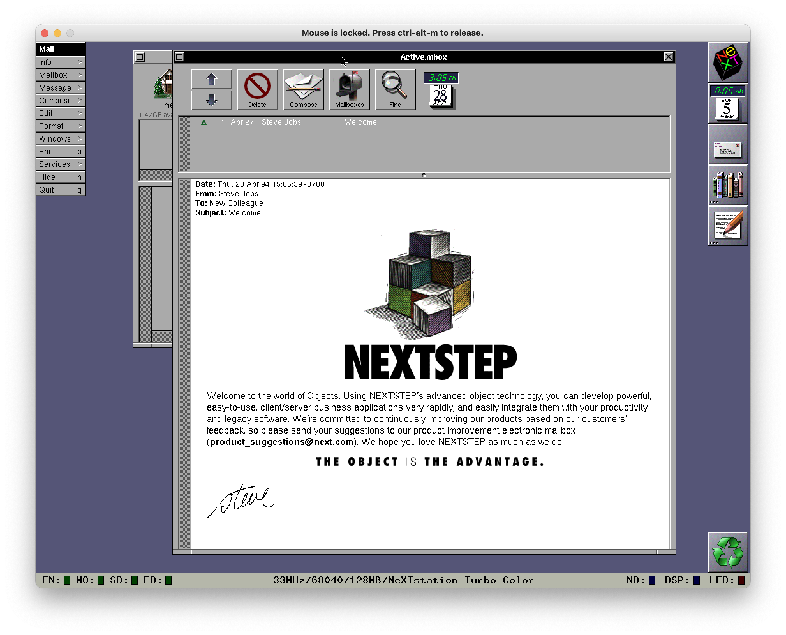

# Abandonware and You: Installing Yesterday's Technology of Tomorrow, Today 

In this series, I'm documenting my experiences with attempting to write and execute a machine learning program (*any* machine learning program) in Python 1.6 on a NeXT hardware emulator running NeXTSTEP.

As outlined in the previous article, I've managed to locate, compile and launch the emulator for the NeXT hardware, charmingly named [Previous](http://previous.alternative-system.com/). 

At this point, it's a bit like the point where you've bought and assembled your PC but not yet installed the operating system (OS). What and how are we going to install on this fresh machine?

## Goal

The high level goal here is to get some instance of NeXTSTEP up and running on Previous. 

That *sounds* relatively straightforward - Previous is, after all, a emulator designed to run NeXTSTEP, so it shouldn't be that hard, should it? 

We'll find out.

## Challenges and decisions

### Defining hardware vs software and the little inbetween

The first thing I found I had to get clear in my mind was what Previous *was*, and what it *wasn't*. This was a little fuzzy because of what you get when you first run Previous.

When you boot Previous with the absolute default settings, you are greeted with a very limited command-line interpreter - is this the boot-up of NeXTSTEP? Is this our OS?

Nah, it turns out - this is the "[ROM Monitor](http://n-1.nl/next/hardware/info/rom-monitor.html)". 

This is essentially the [BIOS](https://en.wikipedia.org/wiki/BIOS) of the device. This is best described as *firmware* - low level software that talks close to the hardware. We can use this to boot *into* our OS.

Thus, we have:
* Previous emulating the hardware, 
* Previous running the ROM monitor firmware,

But we are missing an OS to run on top of these.

### How do we get an Operating System?

The first question one might have is "where do you get 30 year old operating systems?", and the answer is, unsurprisingly, "the internet". 

NeXTSTEP comes under the broad banner of ["abandonware"](https://en.wikipedia.org/wiki/Abandonware) - software that is ignored by its owner and manufacturer (the fact that NeXT went defunct 24 years ago may explain this). Crucially, this means that this software will often be archived and freely shared online, which is exactly the case here. 

I found a few good options to choose from, including [a source that provides boot floppies](http://www.shawcomputing.net/resources/next/hardware/boot_floppies/boot_floppies.html) and [another source that provides pre-built hard-disk images](https://winworldpc.com/product/nextstep/3x). In both instances, we have all kinds of versions of NeXTSTEP to choose.

### What version of NeXTSTEP to install?

I've been describing "NeXTSTEP" as if it was a single OS, but the fact is that it can refer to many different versions, from the first public release of 1988 (*NeXTSTEP 0.8* - not even 1.0!) to the final version from 1997 (*OPENSTEP 4.2*). 

A *huge* amount of development went on during this time, and hardware and software compatibility varied, so picking the right version is important.

After doing a bit of digging, I decided on *NeXTSTEP 3.3* to start. This was the last version under the "NeXTSTEP" name, and was apparently quite mature and trusted - a lot of the references I see in software and READMEs are to this version.

### From scratch or pre-built?

Okay, if we're going to run with *NeXTSTEP 3.3*, how do we want to go about doing so? We actually have a couple of options:

First, we can get copies of the original boot floppies and do a completely fresh install on a totally empty "hard-drive" using Previous - this is akin to putting in a fresh, blank hard-drive into your new computer and doing a fresh install from the system CD/USB.

Secondly, we can download an image of a hard-drive that already has NeXTSTEP installed and boot that - a bit like putting in a hard-drive from your old machine with Windows already installed.

Ultimately, I went for the latter option - while I found [some guides](http://www.nextcomputers.org/forums/index.php?topic=4254.0) for installing from scratch, this path seemed fraught with challenges that *may* be NeXT and *may* be the emulation - a recipe for disaster. Let's take the "safe way" and see how that goes.

### Download and mount

I picked the ["NeXTSTEP 3.3 HD"](https://winworldpc.com/download/0c6a74c3-8e53-3f11-c3a4-c2a90f7054ef) download from WinWorld and away I went. (The fact that there have only been 72 downloads of these images in total via WinWorld makes me think I'm down a pretty esoteric path.) 

Inside the compressed file, you'll find a file called `NS33_2GB.dd` - this is a pre-built image with NeXTSTEP 3.3 installed to the point where it's ready for you, the user, to start configuring and using it. It also includes a robust README that explains in very welcome detail exactly how to configure Previous to get the image up and going (neatly moving past the confusing ROM monitor from above).

When I followed those instructions, the boot went smoothly and I was greeting with a config screen:

And, following the initial configuration and booting up the Mailbox app, I was greeting with the "famous" welcome email from the man himself, Steve Jobs:

Looking good - NeXTSTEP 3.3 is up and running! Now to start using it...

## What next?

With a fresh install of NeXTSTEP, we now have to figure out how to *use* it.

---

## Series review

### Where have we got to?

At this point we have:

* Compiled Previous.
* Found pre-built images of NeXTSTEP. 
* Successfully mounted and launched an image of NeXTSTEP 3.3.

### What did we find?

In this sesh, we:

* Found a good source of [NeXTSTEP boot floppies](http://www.shawcomputing.net/resources/next/hardware/boot_floppies/boot_floppies.html)
    * Importantly, we also found a guide to [install those boot floppies under Previous.](http://www.nextcomputers.org/forums/index.php?topic=4254.0)
* Found a good source of [NeXTSTEP OS and resource images](https://winworldpc.com/product/nextstep/3x)

### What could we explore further?

* Other versions of NeXTSTEP - how different is 0.8? What about 4.2?
* Building from boot floppies - how hard would it actually be to a fresh install from scratch if we wanted to?