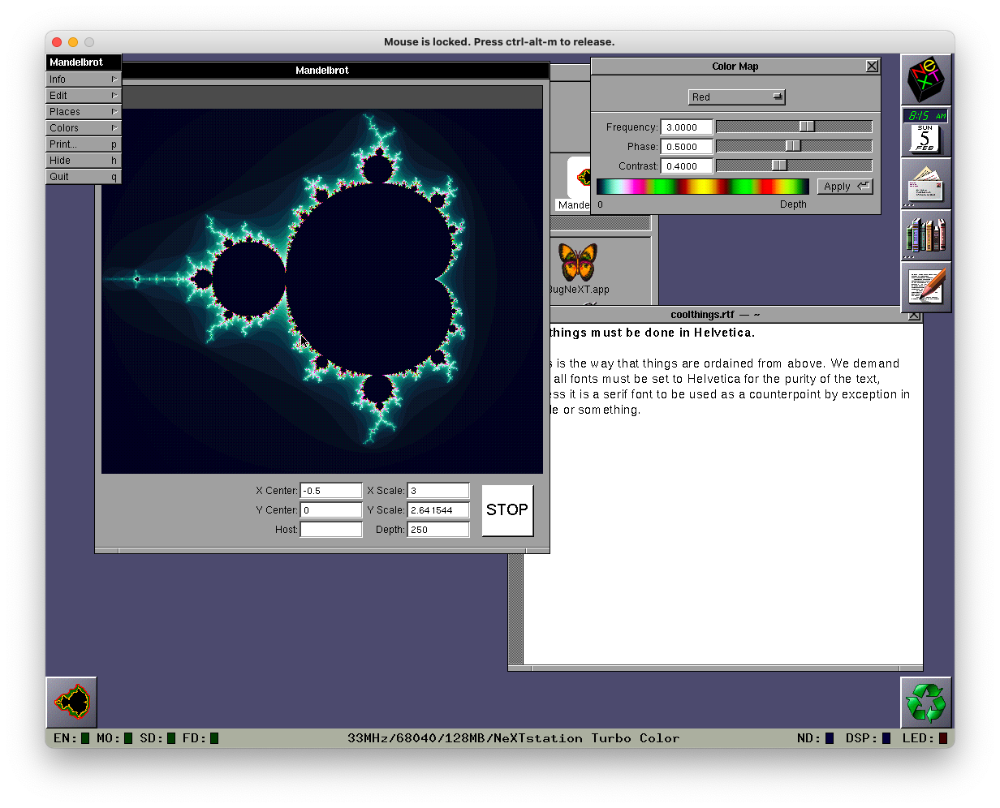

# Networking through the ages

In this series, I'm documenting my experiences with attempting to write and execute a machine learning program (*any* machine learning program) in Python 1.6 on a NeXT hardware emulator running NeXTSTEP.

In the last article, I managed to finally launch a copy of NeXTSTEP 3.3 on the Previous emulator - which is rad, because:

* That's one of the three goals I had! (I'll take my dopamine reward now, please.)
* It's very enjoyable to use the NeXTSTEP operating system (OS). I'm not to do a tour of NeXTSTEP because there is [lots](https://www.youtube.com/watch?v=0sOyuiPtlok&t) and [lots](https://www.youtube.com/watch?v=TIrTh80Z8jw) and [lots](https://www.youtube.com/watch?v=tB0uqZTwZOE) of wonderful content in this space, but needless to say, it's very neat. It feels robust and full-featured in a way older OSes often... don't.

*Pictured: many neat things happening.*

However, there is a key bit of functionality we're missing: file transfers. 

## Goal

Our goal for this session is simple: figure out a simple way to be able to move files from the outside world *into* my NeXTSTEP instance. 

This is going to be required to get files from the internet into the NeXTSTEP environment (like the Python source code, for example).

## Challenges and decisions

### Why not directly connect to the internet?

Interestingly, it might have actually been possible to find a web browser, connect Previous to the internet, and go download the files directly. However, I was wary of this approach for two reasons:

* **Safety** - this "machine" is decades old, and while I doubt there's too much malware for NeXTSTEP floating around, I don't want to take this ancient, unsecured device outside.
* **Pragmatism** - The world wide web has moved on *a lot* since 1994. Even if I just accessed 90s era FTP servers, I suspect this would be painful (...but interesting - perhaps this is an experiment for another day)!

*Come back to me, o internet of the 90s!*

### What are the options for transferring files?

Okay, so what else could I do? A few paths come to mind:

#### "Removable media" 

If I was working with a physical machine, the simplest way I would get files to and fro would be via some kind of removable media - CDs, floppy disks, external harddrives, for example.

Now, because I'm working with a virtual machine, I could probably do the same with virtual removable media. Previous offers all the media connection options of an actual NeXT device, mainly via emulating [SCSI connections](https://en.wikipedia.org/wiki/SCSI).

Using these SCSI connections, I see two main options:

* Removable drives - I could create virtual hard-disks or (shudder) floppy disk images that I could write to on my Ubuntu host machine, load into Previous, and access within NeXTSTEP.
* I could also create [ISO files](https://en.wikipedia.org/wiki/Optical_disc_image) to pass files back and forth, very much as if I was burning them onto CDs. 

Neither are super appealing options, to be honest - both will require a lot of shuttling back and forth of imaginary "removable media"; I'd prefer to leave that in the 90s. But we could give the hard-disk option a go.

#### Trying anyway

The most straightforward path I saw was to build a "fake" disk drive, mount it in Ubuntu, and write the relevant files to it; I could then mount it to the NeXTSTep instance. 

The main challenge is file systems and partitioning - things have changed between 1994 and 2020!

NeXT is fully featured, and is happy to format a blank disk presented to it; but mounting the consequently formatted disk in Ubuntu is painful because its auto-file-system-detection doesn't readily recognise NeXT's own ancient file-system. 

I think this approach has legs, but I decided to explore other options in the meantime.

#### **Network file systems** 

Previous had two files in its core directory of promise: `networking.howto.txt` and `filesharing.howto.txt`. The former walked through how to connect NeXTSTEP to your local network; the latter how to set up a [Network File System](https://en.wikipedia.org/wiki/Network_File_System) server on a Mac and connect the machine to it.

"Surely not," I thought. "No way I could spin up a file server on my local network on a 2018 Mac and have this 26 year OS connect and talk to it happily."

*The proposed network solution.*

It turns out that, in fact, you can. 

#### A "brief" unsuccessful diversion

The instructions, `filesharing.howto.txt`, were a guide on how to set-up a NFS on a separate Mac OS X. I do have a Mac, but it made sense to me (and would be far more convenient) to set up the NFS on the Linux machine which Previous was running on.

*A desired alternative network solution - a bit more elegant.*

However, after a few hours of configuring NFS server options on my Linux machine and combing through the NeXTSTEP forums for guides, I was stuck, with no file transfers to show for it. NeXT simply could not see the NFS server on the same machine.

I still *think* this should be possible, but the problem could be in Previous, or network emulation, or in connecting a NFS client to a server running on the same machine - honestly, there were too many paths for me to go down to even identify an obvious next option, so I sighed, admitted defeat, and went back to the guide.

#### Getting this going 

After following the instructions that came with Previous, I was able to connect to my Mac from Previous in under 10 minutes. Ha! This was helped along by the fact that NeXTSTEP actually has inbuilt utilities to connect to NFS servers:

*Pictured: functional and friendly utilities.*

And I was able to happily create a textfile on my Mac and access it via NeXT - a process that felt very similar to [inter-generational trading in Pokémon](https://bulbapedia.bulbagarden.net/wiki/Trade#Trading_between_game_generations), if we're to be honest.

It's slow as hell, but functional.

## What next?

Well, there we are: I can now get files into NeXTSTEP quickly and easily through a fileshare. In particular, this opens the door to accessing the source code we need to install Python.

---

## Series review

### Where have we got to?

At this point we have:

* Compiled Previous.
* Found pre-built images of NeXTSTEP. 
* Successfully mounted and launched an image of *NeXTSTEP 3.3*.
* Set up a fileshare so we can easily get files onto the system.

### How did we get here?

In this sesh we:

* Connected Previous to the local network, using the [provided instructions](https://github.com/probonopd/previous/blob/master/networking.howto.txt).
* Set up a NFS server on a Mac and then connected to it from Previous, again using the [provided instructions](https://github.com/probonopd/previous/blob/master/filesharing.howto.txt).

### What could we explore further?

* How much *can* we connect a NeXT machine to the internet? Can we get a mid-90s era web browser installed and see what's accessible?
    * Seems there's [some interest](http://www.classiccmp.org/pipermail/cctalk/2015-November/015285.html) in this...
* I never did give the virtual floppy/CD/HD approach much of a go - the latter would be a great activity with lots to learn about images, mounting, and filesystems.