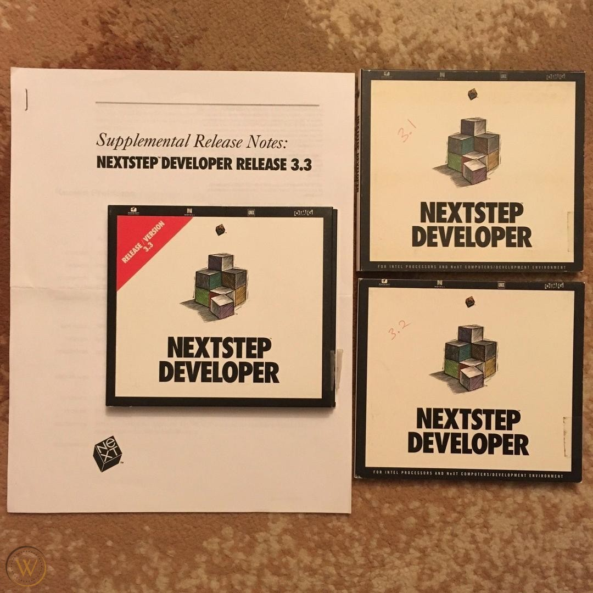
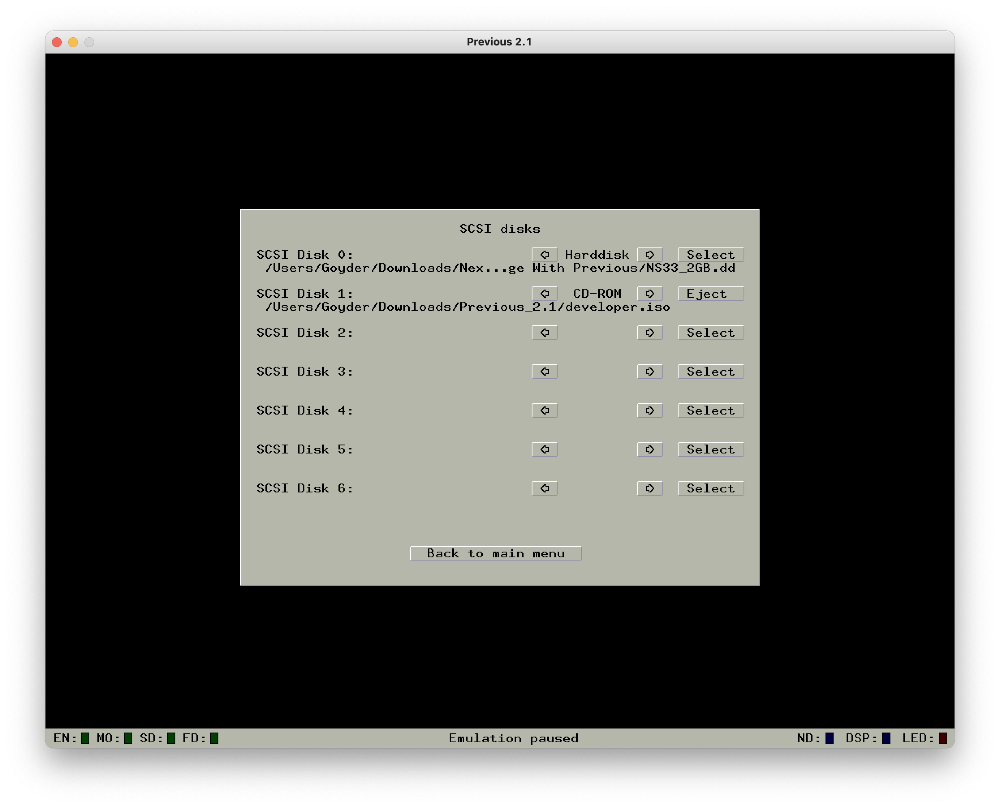
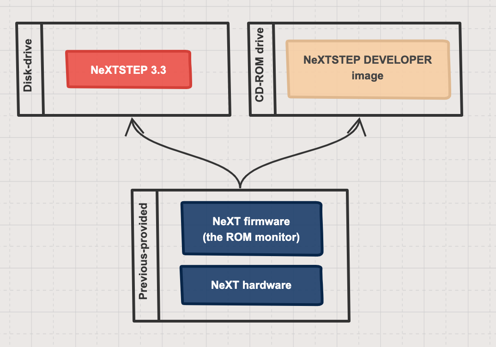
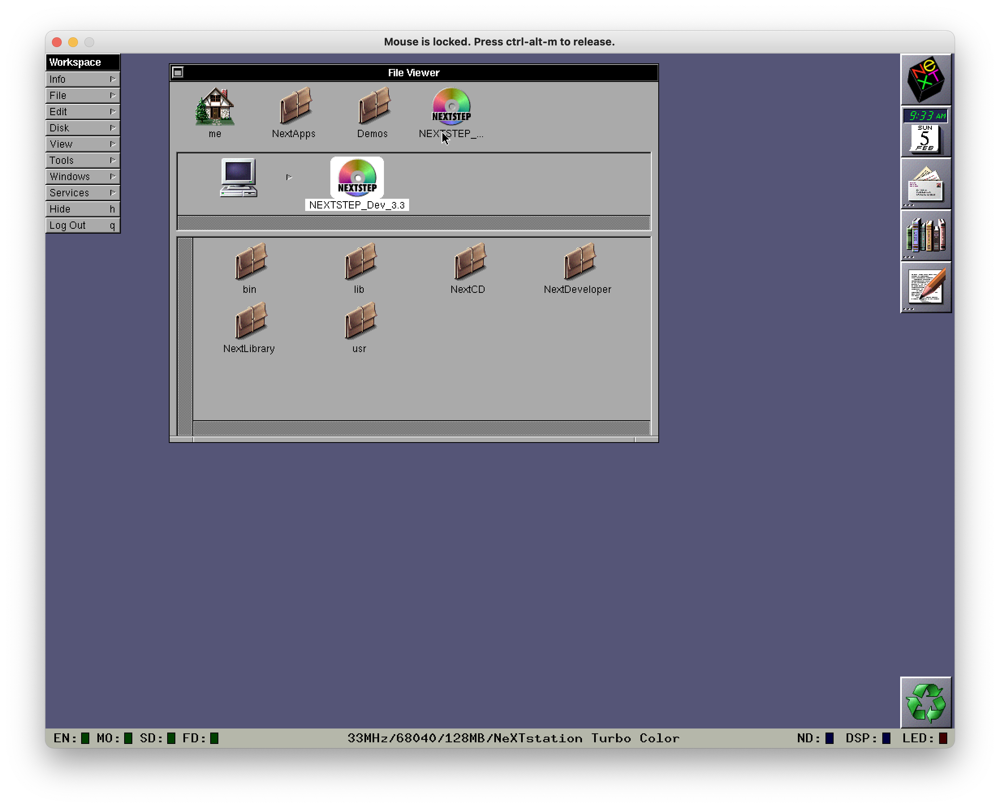
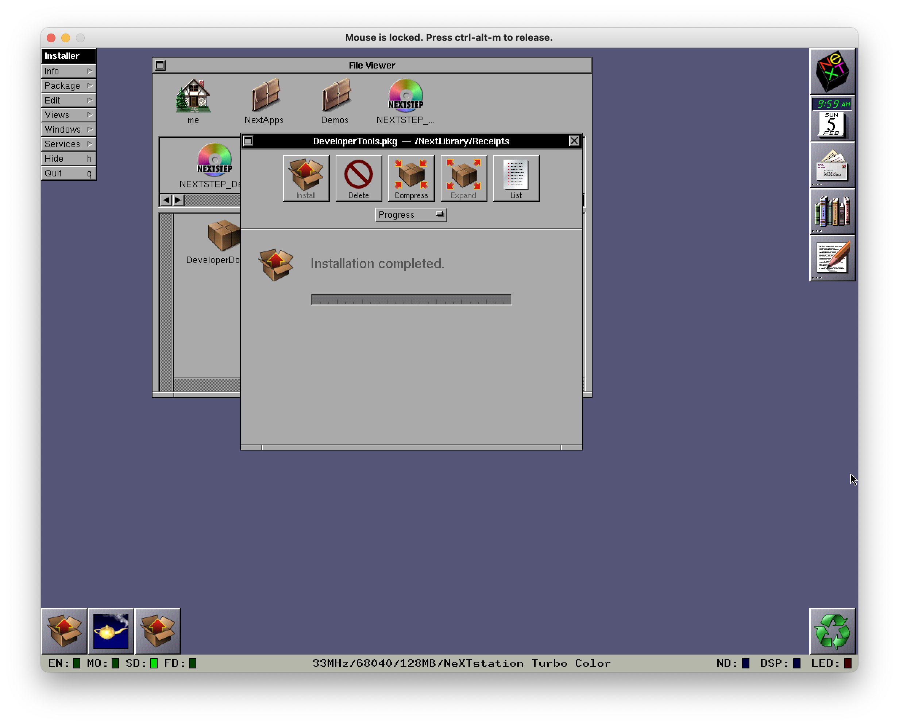
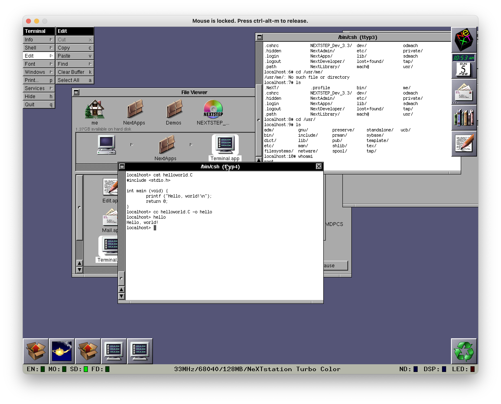

# The NeXT big developer environment

In this series, I'm documenting my experiences with attempting to write and execute a machine learning program (*any* machine learning program) in Python 1.6 on a NeXT hardware emulator running NeXTSTEP.

At this point, I've managed to get the NeXT machine emulator going, found and launched *NeXTSTEP 3.3*, and even connected it a file server on my local network. We're *almost* ready to start compiling Python 1.6 from source - we just need to make sure we have the tools to do so.

## Goal

Our goal in this session is to get some standard developer tools in *NeXTSTEP* installed so we can compile Python 1.6 from source.

## Challenges and decisions

### What "developer tools" do we need?

The standard implementation for Python is "CPython" - this is the Python programming language written in C and Python code. (For interest, there are various other implementations such as [PyPy](en.wikipedia.org/wiki/PyPy) or [Jython](en.wikipedia.org/wiki/Jython) that are worth exploring.) 

CPython 1.6 is what we aim to install, so we'll need make sure we have some version of the [standard C development tools](https://cs.brown.edu/courses/cs033/docs/guides/tools.pdf) installed.

#### ...Do we already have them?

If you bought the $4,999 developer edition of NeXTSTEP/OPENSTEP, it shipped with "NeXTSTEP DEVELOPER", a second disk that had all of the NeXT development tools (see section 3.5 [here](https://www.levenez.com/NeXTSTEP/faq.html) for more details). This disk includes a precompiled instance of [GCC](https://en.wikipedia.org/wiki/GNU_Compiler_Collection), include files, linker libraries, and all of the custom NeXT software that made developing software 10x faster (according to NeXT's marketing team). These tools should be what we need.

However, none of the these programs and utilities are currently installed. This makes sense -  the pre-built disk image I used to *NeXTSTEP 3.3* was totally fresh and appeared to be at the first config step, so it's up to me to install those tools!

[](https://www.worthpoint.com/worthopedia/nextstep-developer-software-lot-1888093898)

### Finding NeXTSTEP DEVELOPER

How do we get our hands on NeXTSTEP DEVELOPER? Well, pretty much the way we got our hands on NeXTSTEP - search through [Abandonware sites](https://en.wikipedia.org/wiki/Abandonware).  

Very quickly I was able to find an ISO (disk image) of [NeXTSTEP DEVELOPER on WinWorld](https://archive.org/details/nextstep3-3dev), the same site that hosted the pre-built disk image of NeXTSTEP 3.3 I'm running. Thanks, WinWorld! 

### Installing NeXTSTEP DEVELOPER

We've got an `.ISO` file sitting on our harddrive - now we have to get that into our virtual environment.

#### Mounting...

First, we need to mount the image into our environment. To do so, we'll use the SCSI connection options within Previous to create a virtual disk drive, and then mount the `.ISO` file. Our SCSI connections should look like this:



Effectively giving us a pretty standard machine, with a harddrive and CD drive attached:



NeXT recognises the CD and it shows up as a new drive, just like on a modern Mac:



#### ...and installing

With the disk ready to go, we can now install the development tools. It turns out this is *super* straightforward - under the path `NextCD/Packages/` there are four `.pkg` files:

* `DeveloperDoc.pkg`
* `DeveloperLibs.pkg`
* `DeveloperTools.pkg`
* `GNUSource.pkg`

And when we open these files, they load in NeXT's in-built Installer app, making installation a breeze. Just make sure to launch them as a user account with sufficient permissions via the OpenSesame utility.

Not knowing what order these should be loaded in (and noting that [others](https://blog.pizzabox.computer/posts/hp712-nextstep-part-2/) were unable to find much information on install order, either) I went ahead and started installing in the following order `DeveloperTools`, `DeveloperLibs`, `GNUSource`, and finally `DeveloperDoc`. 

Each installation was successful on the first run (provided I remembered to run with sufficient permissions!):



All in all, a surprisingly smooth process.

### A final test to make sure this works

To make sure that we actually have a working set of C development tools working, let's write the classic stub of "Hello World" and make sure it compiles. 

We'll write a minimal `helloworld.C`:

```C
#include <stdio.h>

int main (void) {
    printf("Hello, world!\n")
    return 0;
}
```

And fire off the compilation command and verification to check that it works:

```{bash}
localhost> cc helloworld.C -o hello
localhost> hello
Hello, world!
```

And as we can see from the following screenshot - all good! 



We've passed a basic smoke test and can venture into deeper waters.

## What next?

With a working C compiler, we can now attempt to compile Python 1.6 from source. 

Considering the scope of our "Hello, world" test run, this is a bit like going from building a blinky LED circuit to constructing a Volkswagen Mini, but fortune favours the bold!

---

## Series review

### Where have we got to?

At this point we have:

* Compiled Previous.
* Found pre-built images of NeXTSTEP.
* Successfully mounted and launched an image of *NeXTSTEP 3.3*.
* Set up a fileshare so we can easily get files onto the system.
* Found an image of the NeXTSTEP developer tools.
* Installed the developer tools so we have the capability to build Python from source.

### How did we get here?

In this sesh we:

* Located an ISO of NeXTSTEP DEVELOPER ([here](https://archive.org/details/nextstep3-3dev))
* Found a variety of useful information sources on it, including [this very thorough FAQ](https://www.levenez.com/NeXTSTEP/faq.html).
* Mounted the NEXTSTEP DEVELOPER disk and installed the relevant software using NeXT's standard install processes, running them with elevated permissions using OpenSesame. 

### What could we explore further?

* We've barely scratched the surface of the NeXTSTEP DEVELOPER tools. These tools are the technical grandparents of all modern Apple development tools, and it would be fascinating to step through. 
    * [This video](https://www.youtube.com/watch?v=_4hs4K7AEvQ) gives a good walk through of some of the tools (and happens to cover a lot of the same content of this series!)
* I'd like to suss out the ideal text editor - I've been happily working in Vi via the terminal but I'd be surprised if there wasn't a preferred, reasonably well featured text editor built into the NeXTSTEP OS. 