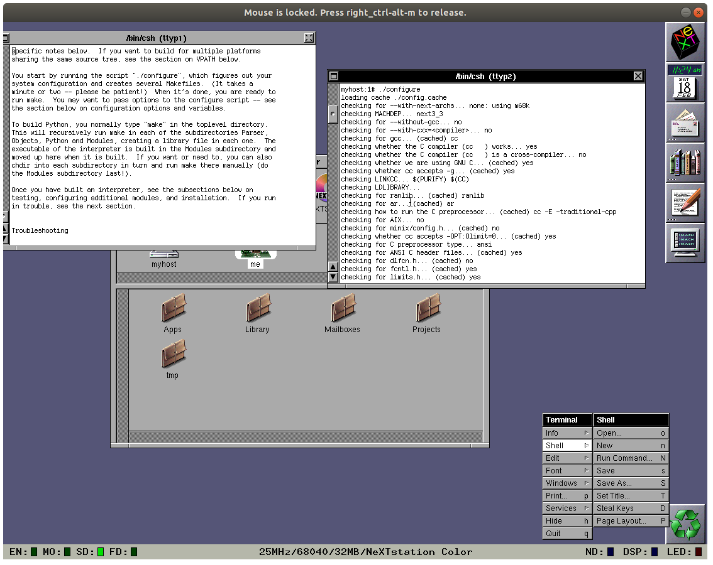

# Compiling Python from source, for fun and frustration

In this series, I'm documenting my experiences with attempting to write and execute a machine learning program (*any* machine learning program) in Python 1.6 on a NeXT hardware emulator running NeXTSTEP.

As of the last post, we have:

* Previous, the NeXT emulator, up and running.
* *NeXTSTEP 3.3* up and running.
* An NFS server up and running, and the NeXT machine connected to it.
* The NeXTSTEP DEVELOPER environment installed and functional.

We're now at the pointy end - it's time to attempt to compile Python 1.6 from source.

## Goal

Our goal for this session is simple and clear: compile Python 1.6 from source, and confirm the interpreter works.

## Challenges and decisions

### Getting the source 

The source code for Python 1.6 is actually still available on the [main Python website](https://www.python.org/), although it's not well advertised nowadays. 

Interestingly, the [download page for Python 1.6](https://www.python.org/download/releases/1.6/download/) has some broken HTML, and it's not possible to click through to agree to the license agreement. However, the [download page for Python 1.6.1](https://www.python.org/download/releases/1.6.1/download) is still functioning, so I went with that. 

Using the NFS previously set up, it was straightforward to move the source [tarball](https://en.wikipedia.org/wiki/Tar_(computing))  into Previous, unpack it, and start to look through the README.


*It's always valuable to look at the README.*

### Getting going...

Flicking through the README, I note that there's special installation instructions for each platform, including NeXT... however, there's nothing other than a note about "fat binaries" (a term which prompted a Google from me, but not much else).

The build instructions are straightforward: first, I just have to run the script `./configure`, which I promptly do. This runs through a huge number of checks, all of which are satisfactory:



And then I just have to run `./make`, which begins strongly:


*Look at those compilations fly!*

### ...and stopping...

Pretty quickly after compilation, it halts with the following error:


Seems like there's an issue with the NeXTSTEP DEVELOPER provided C standard library implementation - apparently they've mixed in some [Objective-C](). This is maybe not surprising (Objective-C was the primary language of choice for NeXT, and for Apple products from OS X onwards until Swift came along), but I am a little surprised it would be implemented in such a way to crash regular C compilation.

Fortunately, the fix has been provided in the error message (that's friendly!) and that can be implemented under compiler options in the very well organised `Makefile`, changing

```make
# Compiler options passed to subordinate makes
OPT=       -g -02 -OPT:0limit=0
```

to

```make
# Compiler options passed to subordinate makes
OPT=       -g -02 -OPT:0limit=0 -ObjC
```

With this change made, calling `make` has the compilation process buzzing along!

### ...and stopping again...

However, this doesn't last. Once we get to the `Modules` section of the compilation process, it bombs out on a compilation error - not enough arguments for a C function, it seems.

I'm not terribly familiar with C compilation, so I'm really coming up the learning cliff on this one, and I take a bit deep dive. After a fair bit of investigation I find:

* Something's crashing in the `_locales` module. The code is making a call to `strcoll` and crapping out, saying there's not enough arguments. That feels like a very blatant oversight for the reasonably-mature-at-this-point Python codebase, so I take a closer look.
* In the Python codebase, I find the line where it's dying, and confirm there's a call to `strcoll` with two arguments, `s1` and `s2`. The call in `_localmodule.C` is perfectly normal - totally textbook! This is a [bog-standard implementation](http://www.cplusplus.com/reference/cstring/strcoll/) of a bog-standard C function. 
* I then dug into the `string.h` file installed with NeXTSTEP DEVELOPER and it's... odd? The function has a totally different signature:
`int strcoll(char *to, size_t maxsize, const char *from)`
This `maxsize` argument seems to come out of nowhere, and is borking the install.
* Looking up this specific implementation, the *only* reference I find to this signature is in the book ["Software Engineering in C"](https://books.google.com.au/books?id=NGkECAAAQBAJ&lpg=PA467&ots=9PyBkAKke1&dq=strcoll(to%2C%20maxsize%2C%20from)&pg=PA467#v=onepage&q=strcoll(to,%20maxsize,%20from)&f=false), which notes that it "documents the proposed ANSI standard C, which is expected to be ratified in 1987."


* I looked up the ANSI standard C implementation of `strcoll`, and `maxsize` was nowhere to be seen.

Or, summarising these findings up in a chain of "whys":


What a journey.

Overall, something's a little awry here - I would love to find out the history of this strange implementation, because I could find naught in my searching. 

### A limiting, but effective, workaround

Thinking there might be a solution in the README, I went back and re-read it. After reading from top to bottom, I found an interesting message for installing under SunOS 4.x:

> When using the standard "cc" compiler, certain modules not be compilable because they use non-K&R syntax. You should be able to get a basic Python interpreter by commenting out such modules in the Modules/Setup file, but I really recommend using gcc.

This sounds good. We're certainly getting errors due to non-standard syntax (although perhaps not like they meant).

I'd previously looked into `gcc`, but couldn't find a  non-NeXT provided  implementation for NeXTSTEP. However, a "basic python interpreter" could certainly be sufficient. 

Sure enough, I was able to jump into the `Modules/Setup` file and begin commenting out the troublesome modules as they cropped up during compilation. (Interestly, it seems there's a lot of intended variation in what modules to install, based on the notes within this file.)

This feels janky, but effective. I can only hope the finished product is sufficient for my needs.

### Hello, snek

Slowly but surely I made progress until it is complete: the `make` process ran to completion (approximately 1 hour of uninterrupted compilation time) and I am greeted with a single blessed `python` executable file. 

I run it, and I am greeted with the beautiful sight of a Python interpreter (and one minor error):


`[GCC neXT DevKit-based CPP 3.1] on next3_3` - I'd like to think that's a compilation message that isn't often seen. 

I ran some basic tests, instantiated and worked with a variety of data types - the interpreter seems good and functional. Success!

## What next?

With the Python interpreter up and running, the only thing left to do is write the basic machine learning script in mid-90s era Python and claim victory!

---

## Series review

### Where have we got to?

At this point we have:

* Compiled Previous
* Found pre-built images of NeXTSTEP.
* Successfully mounted and launched an image of *NeXTSTEP 3.3*.
* Set up a fileshare so we can easily get files onto the system.
* Found an image of the NeXTSTEP developer tools.
* Installed the developer tools we so have the capability to build Python from source.
* Downloaded the source code for Python 1.6 and transferred it onto the NeXT machine.
* Compiled a (hacky, slightly incomplete) version of Python 1.6.

### How did we get here?

In this sesh we:

* Pulled the Python 1.6.1 source code from the [Python website](https://www.python.org/download/releases/1.6.1/download/)
* Transferred the files onto the NeXT machine via our NFS
* Found a "workaround", albeit a limiting one, for our issues with compiling Python 1.6 from source
    * By commenting out troublesome modules from the `Modules/Setup` file, we are able to progress and complete compilation.

### What could we explore further?

* The guidance for compilation noted that the removal of modules might not be necessary if using a bog-standard *gcc* implementation, rather than NeXT's custom version. It could be worthwhile to find an implementation of *gcc* for *NeXTSTEP 3.3* - I've seen enough rumblings on the NeXT forums to think this is possible. 
* There are updates available for *NeXTSTEP 3.3*, and potentially the NEXTSTEP DEVELOPER codebase. Applying these updates may help solve the non-standard C libraries.