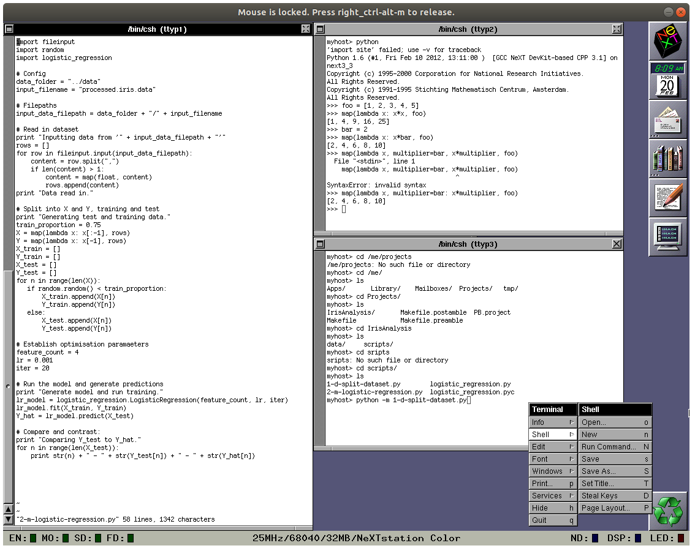
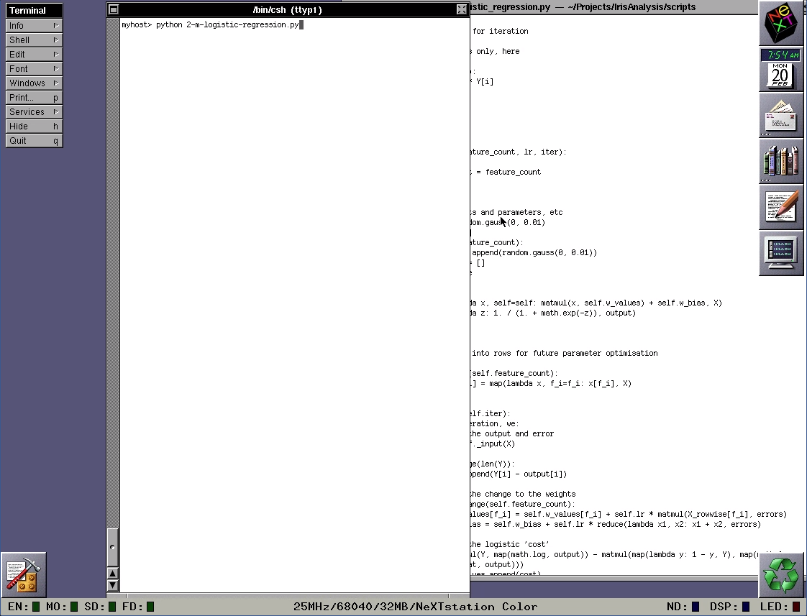

# Running (ML) in the 90's

In this series, I'm documenting my experiences with attempting to write and execute a machine learning program (*any* machine learning program) in Python 1.6 on a NeXT hardware emulator running NeXTSTEP.

## Goal

We're almost there. NeXTSTEP is running. Python's compiled. 

Our end goal is in reach: we now want to write a basic ML script for Python 1.6.

It's time.

## Challenges and decisions

### What "ML" do we want to write?

So here's the first question: what "machine learning" script or program should I develop? 

First, we should consider computational power is limited. NeXT machines ran at double-digit *megahertz* speeds. Whatever algorithm we choose needs to be relatively simple. 

This is not to mention that even relative to our limited computational power, Python is going to *slow*. Nowadays, with supercomputers in our pockets, I think we often forget that Python is a "slow", high level language. When you are working on early 90s hardware, this point will be clear. (So GPU-enabled deep neural networks are off the table for now.)

Ultimately, I decided to implement the logistic regression algorithm. It's a classic binary classifier - often one of, if not the, first taught - and I love its elegance of transforming the classic linear model into the odds ratio into a probability. 



*For a visual refresher of the whole process, consider this video.*

#### Getting the data

For data, I ran with the classics - I decided I would work with the [Iris](https://en.wikipedia.org/wiki/Iris_flower_data_set) dataset. This is a data set most often used for *multiclass* classification, so we'll have to convert it into a binary classification problem.

A copy of the dataset is readily availble from the [UCI Machine Learning Repository](https://archive.ics.uci.edu/ml/datasets/iris), and is easy to transfer to Previous with our NFS.

### A very basic, but very functional development environment

Key question: if we're going to write code in Previous, how are we actually going to *write* it?

Interestingly, NeXTSTEP doesn't seem to have an IDE in our modern sense. There's [Project Builder](http://www.nextcomputers.org/NeXTfiles/Docs/NeXTStep/3.3/nd/DevTools/02_ProjectBuilder/ProjectBuilder.htmld/index.html), which is certainly intended to be the "hub of application development", but this doesn't have a dedicated text editor environment - it offloads that duty to the "Edit" text editor utility. 

If we're just working in text editors, we might as well default to the classic development environment: multiple terminal windows running a shell and Vi. (Vim isn't available by default on NeXTSTEP.)

*I wish this looked cooler. I'll have to figure out how to make it neon green text on a black background.*

### Writing in earnest

With the "development environment" up and going, I got to work on writing the scripts:

* [`1-d-split-dataset.py`](https://gist.github.com/goyder/2738a0f8f2e8a044c2f5c42e2bc8664a), to transform our dataset into a form ready for binary classification.
* [`logistic_regression.py`](https://gist.github.com/goyder/db059e68d3dbcb146bbdbfdd23ee9f38), containing the main logistic regression model class.
* [`2-m-logistic-regression.py`](https://gist.github.com/goyder/7afd63c6e7684c425ce14fcd7de74ec8), to train the logistic regression model on the dataset and use it on some test values.

#### Adapting to Python 1.6

If you look at the code in the above files, it definitely *looks* like modern Python. Most of the hallmarks are there - indentation, clean syntax, all the things we love.

There are definitely a few major and minor differences in Python 1.6, though. In particular I noted:

* `numpy` and `pandas` are sorely missed. (`numpy` apparently existed for Python 1, but I could not find a copy anywhere. `pandas` was years off in the era of 1.x.) There's not a strong system for carrying out linear algebra or numerical calculations, hence the preponderance of `map` and `lambda` calculations and the minimally-implemented matrix multiplication (really just the dot product) in the `logistic_regression.py` script.
* There's a surprising number of "utility" features not yet implemented - things like list comprehensions, the `csv` module, and even the `zip` function are absent and missed! 
* There's all kinds of minor differences - there's no `import <module> as <name>` functionality, for example. If you want to import a module, you better like its name, mister!
* And of course who could forget when `print` wasn't a function? 

Overall, while it's missing a lot of modern conveniences and there are some syntax differences, it's surprisingly quick to get moving in, provided you have the [documentation](https://docs.python.org/release/0.6/) open.

(I still desperately miss `numpy` and `pandas`, though.)

### The proof in the pudding

Okay. Final proof. If we call the entry point to our machine learning script, will it run?

*Click through for the stunning conclusion!*

**Yes!** Albeit pretty slowly. Regardless, it was wonderful to see these scripts running to completion after all of the hard work and tweaking required to get to this point. 

## What next?

There's nothing more! 

In this first article of this series, I set out to a challenge with three components:

1. *Write* and *execute* a machine learning program;
2. In *Python 1.6*,
3. Compiled from source in *NeXTSTEP*. 

The challenge has been achieved, and this silly trophy has been claimed! 

Overall, this has been a really fun experience and a good way to spend a couple of weekends. Besides satisfying my curiosity around NeXT and NeXTSTEP, I've certainly picked up bit of technical know-how as well - in particular, I've broadened my horizons around software compilation (modern and otherwise) and *nix disk management and mounting.

That's all there is - I hope you've enjoyed this series, and I hope you can use my materials provided in these articles to pursue your own NeXT adventures.

---

## Series review

### Where have we got to?

At this point we have:

* Compiled Previous
* Found pre-built images of NeXTSTEP.
* Successfully mounted and launched an image of *NeXTSTEP 4.3*.
* Set up a fileshare so we can easily get files onto the system.
* Found an image of the NeXTSTEP developer tools.
* Installed the developer tools we so have the capability to build Python from source.
* Downloaded the source code for Python 1.6 and transferred it onto the NeXT machine.
* Compiled a (hacky, slightly incomplete) version of Python 1.6.
* Wrote a Python 1.6 script to carry out a logistic regression script.

### How did we get here?

In this sesh we:

* Downloaded the classic [Iris](https://archive.ics.uci.edu/ml/datasets/Iris) dataset and transferred it into the Previous environment via the NFS.
* Found the [Python 1.6 reference documentation](https://docs.python.org/release/1.6/).
* Wrote a script to transform the raw dataset into a form suitable for our logistic regression script.
* Wrote a logistic regression model that allows for training and prediction.
* **Successfully ran the logistic regression model script *in* Python 1.6 *in* NeXTSTEP!**

### What could we explore further?

* [NumPy](https://numpy.org/), Python's most critical array based tool, apparently existed in one form or another in Python 1.6. It'd be interesting to find and install a compatible version.
* Speaking of installing packages, Python 1.6 was a time before `pip` (and before `easy_install`, for that matter) - it would be a good exercise to try managing this Python package environment in its earlier form, if only to gain an appreciation for how good we have it now.
* It would be fun to explore building a ML tool in NeXT's in-built developer tools, to really get the authentic NeXT ML solution!
* If we deployed Previous instance into a Docker container and somehow set this up via an API, we could truly take the claim of the very worst Dockerised ML solution ever (not to mention this would be a fun and interesting technical challenge).
